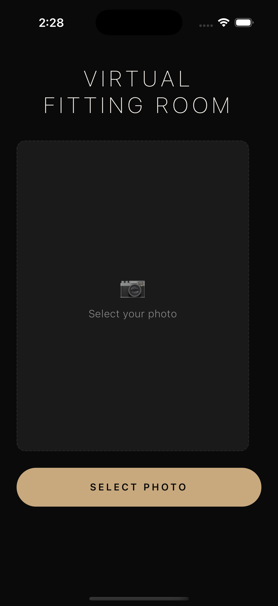
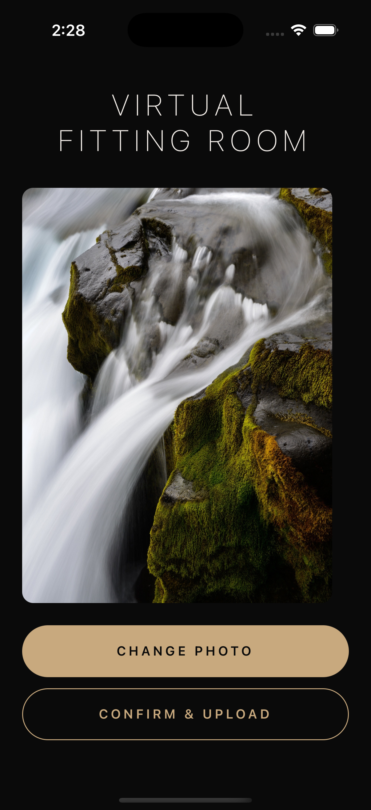
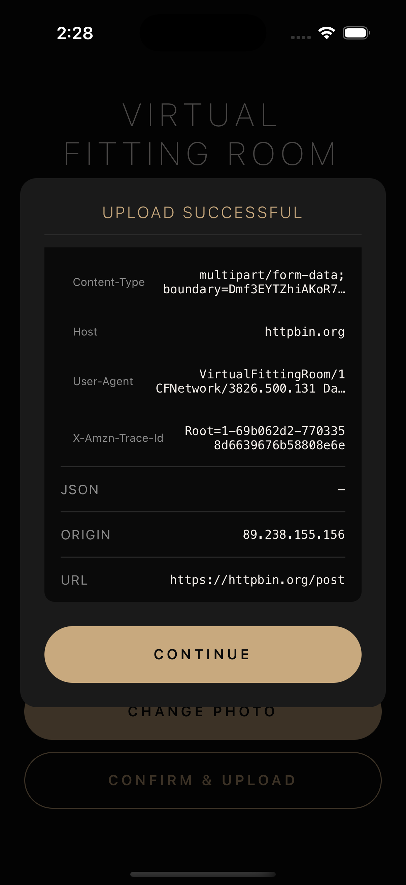
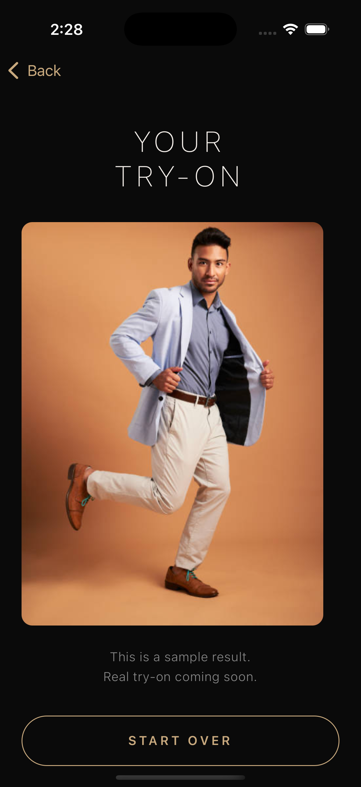

# Virtual Fitting Room

A React Native mobile app that lets users upload a photo of themselves and virtually try on clothing items. The app captures or selects a photo, sends it to a backend API for processing, and displays the try-on result.

## Screenshots

<p align="center">
  
  
</p>
<p align="center">
  
  
</p>

## Tech Stack

- React Native 0.84 with React 19
- TypeScript 5.8
- React Navigation (native stack)
- react-native-image-picker for photo selection
- Jest + React Native Testing Library for tests

## Project Structure

```
src/
├── components/        # Reusable UI (ErrorBanner, ResponseModal)
├── screens/           # PhotoUploadScreen, TryOnResultScreen
├── services/          # API layer (uploadPhoto)
├── navigation/        # Stack param types
├── theme.ts           # Design tokens (colors, typography, spacing)
└── assets/            # Static images
```

## Design Decisions

- **Local state only** - The app has two screens and a linear flow, so `useState` is sufficient. Adding Redux or Zustand would be unnecessary here.
- **Centralized theme tokens** - Colors, typography, and spacing live in a single `theme.ts` file imported directly by components, keeping styling consistent without the overhead of a context-based theme provider.
- **Feature-oriented folder structure** - Code is organized by role (`screens/`, `components/`, `services/`) rather than by feature, which fits the app's small scope while staying familiar to any RN developer.
- **Plain fetch for API calls** - The app makes a single POST request, so the built-in `fetch` API is enough. Adding Axios or React Query would introduce dependencies with no practical benefit at this scale.

## Design Direction

- **Aesthetic** - Editorial / Fashion-forward — a dark, sophisticated palette inspired by luxury fashion apps. Confident typography, generous spacing, and subtle elegance. The app feels like preparing for a fashion shoot, not uploading a file.

## Getting Started

### Prerequisites

- Node.js >= 22.11.0
- [React Native development environment](https://reactnative.dev/docs/set-up-your-environment) configured for your target platform(s)
- Xcode (for iOS)
- Android Studio (for Android)

### Install dependencies

```sh
npm install
```

### iOS

Install CocoaPods dependencies (first time or after updating native deps):

```sh
bundle install
bundle exec pod install
```

Start Metro and run the app:

```sh
npm start
# In a separate terminal
npm run ios
```

### Android

```sh
npm start
# In a separate terminal
npm run android
```

## Testing

Every screen, component, and service has a corresponding test file mirroring the `src/` structure under `__tests__/`. Coverage thresholds are enforced at 80% for branches, functions, lines, and statements.

```sh
npm test

# With coverage report
npx jest --coverage
```

## Linting

```sh
npm run lint
```
